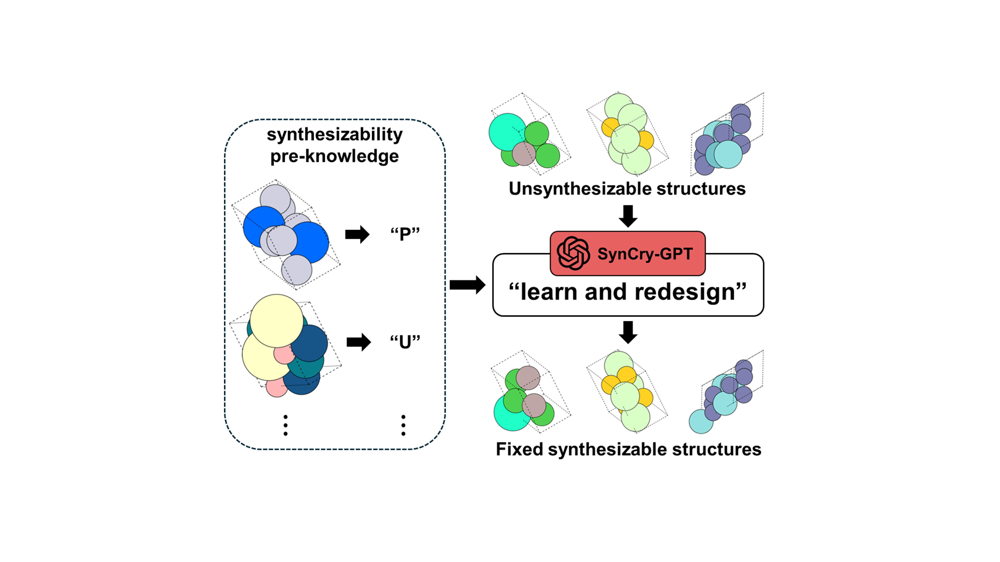

# SynCry

The SynCry framework was developed by Prof. Yousung Jung's group at Seoul National University
(contact: yousung@gmail.com)

This code is used for redesigning infeasible inorganic crystal structures into synthesizable compounds using LLM.

# Developer
Feel free to reach out to Jaehwan Choi and Seongmin Kim for any other technical solutions: jaehwan.micc@gmail.com, smkim.micc@gmail.com

# Data Availability
You can start the first step of the entire framework by downloading the zip files from this link. https://zenodo.org/records/14614258

The test_set is used for the overall framework, including structural modification and chemical analysis.

The train_set and val_set are used for constructing SynCry-GPT during the fine-tuning process.

# Citation
under review
